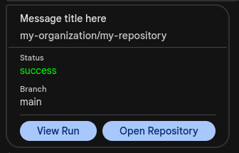

# Google Chat Build Message Action

This GitHub Action sends build status notifications to Google Chat.


## Inputs

| Name         | Description               | Required |
|--------------|---------------------------|----------|
| `webhook-url`| Google Chat webhook URL  | Yes      |
| `name`       | Name of the build        | Yes      |

## Usage Example

Create a new webhook in Google Chat and add the URL to your repository secrets.

```yaml
      (...)
      - name: Notify Google Chat
        uses: agro1desenvolvimento//gchat-action-msg@v1
        if: always()
        with:
          webhook-url: ${{ secrets.GOOGLECHAT_WEBHOOK_BUILD_URL }}
          name: "Message Title"
      (...)
```

